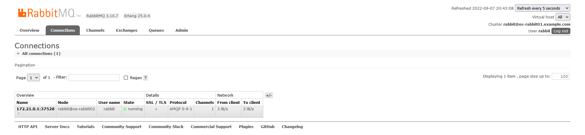
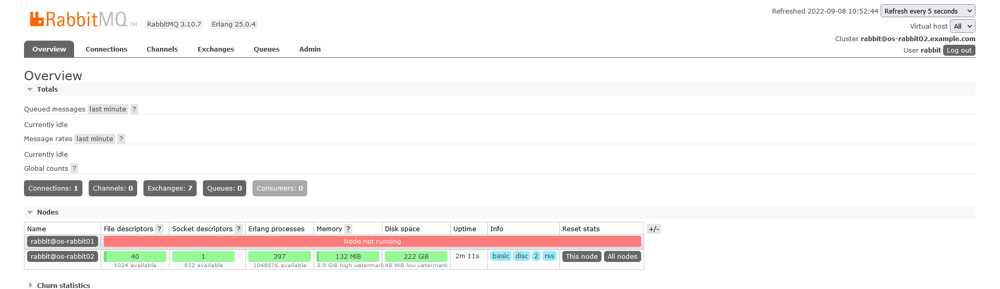
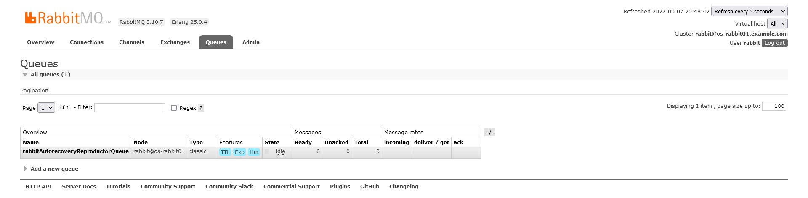
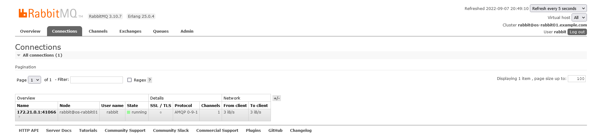

# rabbitAutorecoveryReproductor
minimal reproducible example for my problems with rabbitmq autorecovery

## prerequisites

* openjdk11
* docker
* docker-compose

## Usage

0. In `.env` file set the tag of rabbit docker image you want to test, pick one from https://hub.docker.com/_/rabbitmq/tags
1. Run rabbit servers using docker-compose: 
   ```
   cd docker
   sudo docker-compose down -v         # clean after previous run if necessary  
   sudo docker-compose up -d rabbit1
   sleep 10                            # we want to wait for rabbit1 to start before starting rabbit2 to aviod split-brain condition
   sudo docker-compose up -d rabbit2
   ```
   
2. Navigate to rabbit gui, you may login as user=rabbit, pass=rabbit 
   * rabbit1: http://localhost:15671/#/
   * rabbit2: http://localhost:15672/#/
   
3. Build and run the java application `com.example.rabbitautorecoveryreproductor.RabbitAutorecoveryReproductorMain`
   ```   
   gradlew installDist
   app/build/install/app/bin/app
   ```
   
   You should see this:
   ```
   2022-09-07 20:37:12 INFO  RabbitAutorecoveryReproductorMain:40 - Connecting as username=rabbit, password=****** to hosts=localhost:5671,localhost:5672
   2022-09-07 20:37:12 DEBUG AmqpConnectionFactory:30 - adding address host=localhost, port=5671
   2022-09-07 20:37:12 DEBUG AmqpConnectionFactory:30 - adding address host=localhost, port=5672
   2022-09-07 20:37:12 DEBUG ConsumerWorkService:40 - Creating executor service with 3 thread(s) for consumer work service
   2022-09-07 20:37:12 INFO  RabbitAutorecoveryReproductorMain:50 - Started consumer on AMQP rabbitAutorecoveryReproductorQueue
   Hit enter to finish the consumer.
   ```
   The consumer will run till you hit enter on stdin. 

4. Go to rabbit GUI, you will see that:
   * there is 1 connection with 1 channel fro the consumer 
     
   * there is 1 queue `rabbitAutorecoveryReproductorQueue`
     

5. Here the consumer is connected to os-rabbit2 node. 
   So stop it in docker:
   ```
   sudo docker-compose stop rabbit2
   ```
## Problem reproduced - autorecovery failed

Output in the consumer stdout:

* Only the connection is recovered.
* But there is 0 channels in that connection and 0 consumers and no queue:
  
  
* Consumer log shows autorecovery exceptions caused by IOException
```
2022-09-08 10:50:58 INFO  RabbitAutorecoveryReproductorMain:40 - Connecting as username=rabbit, password=****** to hosts=localhost:5671,localhost:5672
2022-09-08 10:50:58 DEBUG AmqpConnectionFactory:30 - adding address host=localhost, port=5671
2022-09-08 10:50:58 DEBUG AmqpConnectionFactory:30 - adding address host=localhost, port=5672
2022-09-08 10:50:58 DEBUG ConsumerWorkService:40 - Creating executor service with 8 thread(s) for consumer work service
2022-09-08 10:50:58 INFO  RabbitAutorecoveryReproductorMain:50 - Started consumer on AMQP rabbitAutorecoveryReproductorQueue 
Hit enter to finish the consumer.2022-09-08 10:51:47 DEBUG ConsumerWorkService:40 - Creating executor service with 8 thread(s) for consumer work service
2022-09-08 10:51:47 DEBUG ConsumerWorkService:40 - Creating executor service with 8 thread(s) for consumer work service
2022-09-08 10:51:47 DEBUG AutorecoveringConnection:588 - Connection amqp://rabbit@127.0.0.1:5672/ has recovered
2022-09-08 10:51:47 DEBUG AutorecoveringConnection:648 - Channel AMQChannel(amqp://rabbit@127.0.0.1:5672/,1) has recovered
2022-09-08 10:51:47 DEBUG AutorecoveringConnection:799 - Recovering RecordedQueue[name=rabbitAutorecoveryReproductorQueue, durable=false, autoDelete=false, exclusive=false, arguments={x-expires=259200000, x-message-ttl=600000, x-max-length=500000}serverNamed=false, channel=AMQChannel(amqp://rabbit@127.0.0.1:5672/,1)]
2022-09-08 10:51:47 ERROR ForgivingExceptionHandler:119 - Caught an exception when recovering topology Caught an exception while recovering queue rabbitAutorecoveryReproductorQueue: null
com.rabbitmq.client.TopologyRecoveryException: Caught an exception while recovering queue rabbitAutorecoveryReproductorQueue: null
	at com.rabbitmq.client.impl.recovery.AutorecoveringConnection.recoverQueue(AutorecoveringConnection.java:782) ~[amqp-client-5.15.0.jar:5.15.0]
	at com.rabbitmq.client.impl.recovery.AutorecoveringConnection.recoverTopology(AutorecoveringConnection.java:721) ~[amqp-client-5.15.0.jar:5.15.0]
	at com.rabbitmq.client.impl.recovery.AutorecoveringConnection.beginAutomaticRecovery(AutorecoveringConnection.java:597) ~[amqp-client-5.15.0.jar:5.15.0]
	at com.rabbitmq.client.impl.recovery.AutorecoveringConnection.lambda$addAutomaticRecoveryListener$3(AutorecoveringConnection.java:519) ~[amqp-client-5.15.0.jar:5.15.0]
	at com.rabbitmq.client.impl.AMQConnection.notifyRecoveryCanBeginListeners(AMQConnection.java:817) ~[amqp-client-5.15.0.jar:5.15.0]
	at com.rabbitmq.client.impl.AMQConnection.doFinalShutdown(AMQConnection.java:794) ~[amqp-client-5.15.0.jar:5.15.0]
	at com.rabbitmq.client.impl.AMQConnection$MainLoop.run(AMQConnection.java:678) ~[amqp-client-5.15.0.jar:5.15.0]
	at java.lang.Thread.run(Thread.java:829) ~[?:?]
Caused by: java.io.IOException
	at com.rabbitmq.client.impl.AMQChannel.wrap(AMQChannel.java:129) ~[amqp-client-5.15.0.jar:5.15.0]
	at com.rabbitmq.client.impl.AMQChannel.wrap(AMQChannel.java:125) ~[amqp-client-5.15.0.jar:5.15.0]
	at com.rabbitmq.client.impl.AMQChannel.exnWrappingRpc(AMQChannel.java:147) ~[amqp-client-5.15.0.jar:5.15.0]
	at com.rabbitmq.client.impl.ChannelN.queueDeclare(ChannelN.java:968) ~[amqp-client-5.15.0.jar:5.15.0]
	at com.rabbitmq.client.impl.ChannelN.queueDeclare(ChannelN.java:46) ~[amqp-client-5.15.0.jar:5.15.0]
	at com.rabbitmq.client.impl.recovery.RecordedQueue.recover(RecordedQueue.java:60) ~[amqp-client-5.15.0.jar:5.15.0]
	at com.rabbitmq.client.impl.recovery.AutorecoveringConnection.lambda$internalRecoverQueue$13(AutorecoveringConnection.java:803) ~[amqp-client-5.15.0.jar:5.15.0]
	at com.rabbitmq.client.impl.recovery.AutorecoveringConnection.wrapRetryIfNecessary(AutorecoveringConnection.java:909) ~[amqp-client-5.15.0.jar:5.15.0]
	at com.rabbitmq.client.impl.recovery.AutorecoveringConnection.internalRecoverQueue(AutorecoveringConnection.java:802) ~[amqp-client-5.15.0.jar:5.15.0]
	at com.rabbitmq.client.impl.recovery.AutorecoveringConnection.recoverQueue(AutorecoveringConnection.java:778) ~[amqp-client-5.15.0.jar:5.15.0]
	... 7 more
Caused by: com.rabbitmq.client.ShutdownSignalException: channel error; protocol method: #method<channel.close>(reply-code=404, reply-text=NOT_FOUND - queue 'rabbitAutorecoveryReproductorQueue' in vhost '/' process is stopped by supervisor, class-id=50, method-id=10)
	at com.rabbitmq.utility.ValueOrException.getValue(ValueOrException.java:66) ~[amqp-client-5.15.0.jar:5.15.0]
	at com.rabbitmq.utility.BlockingValueOrException.uninterruptibleGetValue(BlockingValueOrException.java:36) ~[amqp-client-5.15.0.jar:5.15.0]
	at com.rabbitmq.client.impl.AMQChannel$BlockingRpcContinuation.getReply(AMQChannel.java:502) ~[amqp-client-5.15.0.jar:5.15.0]
	at com.rabbitmq.client.impl.AMQChannel.privateRpc(AMQChannel.java:293) ~[amqp-client-5.15.0.jar:5.15.0]
	at com.rabbitmq.client.impl.AMQChannel.exnWrappingRpc(AMQChannel.java:141) ~[amqp-client-5.15.0.jar:5.15.0]
	at com.rabbitmq.client.impl.ChannelN.queueDeclare(ChannelN.java:968) ~[amqp-client-5.15.0.jar:5.15.0]
	at com.rabbitmq.client.impl.ChannelN.queueDeclare(ChannelN.java:46) ~[amqp-client-5.15.0.jar:5.15.0]
	at com.rabbitmq.client.impl.recovery.RecordedQueue.recover(RecordedQueue.java:60) ~[amqp-client-5.15.0.jar:5.15.0]
	at com.rabbitmq.client.impl.recovery.AutorecoveringConnection.lambda$internalRecoverQueue$13(AutorecoveringConnection.java:803) ~[amqp-client-5.15.0.jar:5.15.0]
	at com.rabbitmq.client.impl.recovery.AutorecoveringConnection.wrapRetryIfNecessary(AutorecoveringConnection.java:909) ~[amqp-client-5.15.0.jar:5.15.0]
	at com.rabbitmq.client.impl.recovery.AutorecoveringConnection.internalRecoverQueue(AutorecoveringConnection.java:802) ~[amqp-client-5.15.0.jar:5.15.0]
	at com.rabbitmq.client.impl.recovery.AutorecoveringConnection.recoverQueue(AutorecoveringConnection.java:778) ~[amqp-client-5.15.0.jar:5.15.0]
	... 7 more
Caused by: com.rabbitmq.client.ShutdownSignalException: channel error; protocol method: #method<channel.close>(reply-code=404, reply-text=NOT_FOUND - queue 'rabbitAutorecoveryReproductorQueue' in vhost '/' process is stopped by supervisor, class-id=50, method-id=10)
	at com.rabbitmq.client.impl.ChannelN.asyncShutdown(ChannelN.java:517) ~[amqp-client-5.15.0.jar:5.15.0]
	at com.rabbitmq.client.impl.ChannelN.processAsync(ChannelN.java:341) ~[amqp-client-5.15.0.jar:5.15.0]
	at com.rabbitmq.client.impl.AMQChannel.handleCompleteInboundCommand(AMQChannel.java:182) ~[amqp-client-5.15.0.jar:5.15.0]
	at com.rabbitmq.client.impl.AMQChannel.handleFrame(AMQChannel.java:114) ~[amqp-client-5.15.0.jar:5.15.0]
	at com.rabbitmq.client.impl.AMQConnection.readFrame(AMQConnection.java:739) ~[amqp-client-5.15.0.jar:5.15.0]
	at com.rabbitmq.client.impl.AMQConnection.access$300(AMQConnection.java:47) ~[amqp-client-5.15.0.jar:5.15.0]
	at com.rabbitmq.client.impl.AMQConnection$MainLoop.run(AMQConnection.java:666) ~[amqp-client-5.15.0.jar:5.15.0]
	... 1 more
2022-09-08 10:51:47 DEBUG AutorecoveringConnection:880 - Recovering RecordedConsumer[tag=rabbitAutorecoveryReproductor, queue=rabbitAutorecoveryReproductorQueue, autoAck=false, exclusive=false, arguments=null, consumer=com.example.rabbitautorecoveryreproductor.AmqpConsumer@4ab19799, channel=AMQChannel(amqp://rabbit@127.0.0.1:5672/,1)]
2022-09-08 10:51:47 ERROR ForgivingExceptionHandler:119 - Caught an exception when recovering topology Caught an exception while recovering consumer rabbitAutorecoveryReproductor: channel is already closed due to channel error; protocol method: #method<channel.close>(reply-code=404, reply-text=NOT_FOUND - queue 'rabbitAutorecoveryReproductorQueue' in vhost '/' process is stopped by supervisor, class-id=50, method-id=10)
com.rabbitmq.client.TopologyRecoveryException: Caught an exception while recovering consumer rabbitAutorecoveryReproductor: channel is already closed due to channel error; protocol method: #method<channel.close>(reply-code=404, reply-text=NOT_FOUND - queue 'rabbitAutorecoveryReproductorQueue' in vhost '/' process is stopped by supervisor, class-id=50, method-id=10)
	at com.rabbitmq.client.impl.recovery.AutorecoveringConnection.recoverConsumer(AutorecoveringConnection.java:863) ~[amqp-client-5.15.0.jar:5.15.0]
	at com.rabbitmq.client.impl.recovery.AutorecoveringConnection.recoverTopology(AutorecoveringConnection.java:727) ~[amqp-client-5.15.0.jar:5.15.0]
	at com.rabbitmq.client.impl.recovery.AutorecoveringConnection.beginAutomaticRecovery(AutorecoveringConnection.java:597) ~[amqp-client-5.15.0.jar:5.15.0]
	at com.rabbitmq.client.impl.recovery.AutorecoveringConnection.lambda$addAutomaticRecoveryListener$3(AutorecoveringConnection.java:519) ~[amqp-client-5.15.0.jar:5.15.0]
	at com.rabbitmq.client.impl.AMQConnection.notifyRecoveryCanBeginListeners(AMQConnection.java:817) ~[amqp-client-5.15.0.jar:5.15.0]
	at com.rabbitmq.client.impl.AMQConnection.doFinalShutdown(AMQConnection.java:794) ~[amqp-client-5.15.0.jar:5.15.0]
	at com.rabbitmq.client.impl.AMQConnection$MainLoop.run(AMQConnection.java:678) ~[amqp-client-5.15.0.jar:5.15.0]
	at java.lang.Thread.run(Thread.java:829) ~[?:?]
Caused by: com.rabbitmq.client.AlreadyClosedException: channel is already closed due to channel error; protocol method: #method<channel.close>(reply-code=404, reply-text=NOT_FOUND - queue 'rabbitAutorecoveryReproductorQueue' in vhost '/' process is stopped by supervisor, class-id=50, method-id=10)
	at com.rabbitmq.client.impl.AMQChannel.ensureIsOpen(AMQChannel.java:258) ~[amqp-client-5.15.0.jar:5.15.0]
	at com.rabbitmq.client.impl.AMQChannel.rpc(AMQChannel.java:341) ~[amqp-client-5.15.0.jar:5.15.0]
	at com.rabbitmq.client.impl.ChannelN.basicConsume(ChannelN.java:1371) ~[amqp-client-5.15.0.jar:5.15.0]
	at com.rabbitmq.client.impl.recovery.RecordedConsumer.recover(RecordedConsumer.java:60) ~[amqp-client-5.15.0.jar:5.15.0]
	at com.rabbitmq.client.impl.recovery.AutorecoveringConnection.wrapRetryIfNecessary(AutorecoveringConnection.java:909) ~[amqp-client-5.15.0.jar:5.15.0]
	at com.rabbitmq.client.impl.recovery.AutorecoveringConnection.internalRecoverConsumer(AutorecoveringConnection.java:884) ~[amqp-client-5.15.0.jar:5.15.0]
	at com.rabbitmq.client.impl.recovery.AutorecoveringConnection.recoverConsumer(AutorecoveringConnection.java:859) ~[amqp-client-5.15.0.jar:5.15.0]
	... 7 more

```

## Problem not reproduced - autorecovery success

* The queue, connection, channel and consumer are all correctly autorecovered:


* No exceptions in consumer log:
```
2022-09-07 20:47:22 DEBUG ConsumerWorkService:40 - Creating executor service with 3 thread(s) for consumer work service
2022-09-07 20:47:22 DEBUG AutorecoveringConnection:588 - Connection amqp://rabbit@127.0.0.1:5671/ has recovered
2022-09-07 20:47:23 DEBUG AutorecoveringConnection:648 - Channel AMQChannel(amqp://rabbit@127.0.0.1:5671/,1) has recovered
2022-09-07 20:47:23 DEBUG AutorecoveringConnection:799 - Recovering RecordedQueue[name=rabbitAutorecoveryReproductorQueue, durable=false, autoDelete=false, exclusive=false, arguments={x-expires=259200000, x-message-ttl=600000, x-max-length=500000}serverNamed=false, channel=AMQChannel(amqp://rabbit@127.0.0.1:5671/,1)]
2022-09-07 20:47:23 DEBUG AutorecoveringConnection:825 - RecordedQueue[name=rabbitAutorecoveryReproductorQueue, durable=false, autoDelete=false, exclusive=false, arguments={x-expires=259200000, x-message-ttl=600000, x-max-length=500000}serverNamed=false, channel=AMQChannel(amqp://rabbit@127.0.0.1:5671/,1)] has recovered
2022-09-07 20:47:23 DEBUG AutorecoveringConnection:880 - Recovering RecordedConsumer[tag=rabbitAutorecoveryReproductor, queue=rabbitAutorecoveryReproductorQueue, autoAck=false, exclusive=false, arguments=null, consumer=com.example.rabbitautorecoveryreproductor.AmqpConsumer@4127b387, channel=AMQChannel(amqp://rabbit@127.0.0.1:5671/,1)]
2022-09-07 20:47:23 DEBUG AutorecoveringConnection:903 - RecordedConsumer[tag=rabbitAutorecoveryReproductor, queue=rabbitAutorecoveryReproductorQueue, autoAck=false, exclusive=false, arguments=null, consumer=com.example.rabbitautorecoveryreproductor.AmqpConsumer@4127b387, channel=AMQChannel(amqp://rabbit@127.0.0.1:5671/,1)] has recovered
```

## Hypothesis to check

* does setting `.erlang.cookie` via `RABBITMQ_ERLANG_COOKIE` env variable instead of `command: ["bash", "-c", "echo erlangCookie > /var/lib/rabbitmq/.erlang.cookie ; chmod 400 /var/lib/rabbitmq/.erlang.cookie; rabbitmq-server"]` has any influence? It seems it leads to higher probability of reproduction.
* do additional `cluster_formation` options in `rabbitmq.conf` have any effect on the problem?
* do additional `rabbit03`, `rabbit04` nodes in `rabbitmq.conf` have any effect on the problem?